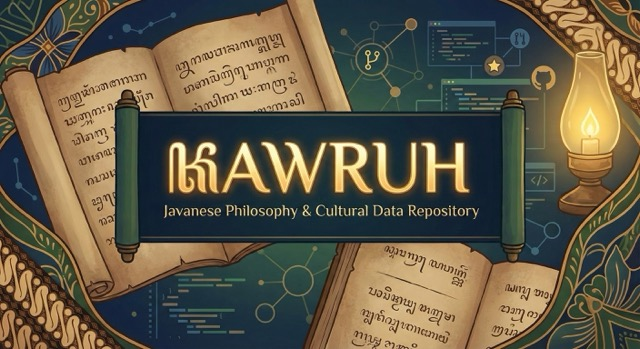

# Kawruh ꦏꦮꦿꦸꦃ




**Kawruh** (Javanese: *Knowledge*) is an open-source database of Javanese philosophy, metaphysics, and linguistic logic. 

It preserves concepts like *Kerata Basa* (etymological philosophy), *Sanepa* (sarcasm/paradox), and *Paribasan* (social laws) in a machine-readable format (JSON) for developers, data scientists, and cultural preservationists.

## 📂 Data Structure

All data is stored in the `data/` directory.

| File | Content | Logic |
| :--- | :--- | :--- |
| `kerata_basa.json` | **Jarwo Dosok** | Etymological dissection of words to find philosophical meaning. |
| `sanepa.json` | **Paradoxes** | Irony and sarcasm constants (e.g., *Pait Madu* = Very Sweet). |
| `paribasan.json` | **Axioms** | Social rules and consequences (Karma, Law, Economy). |
| `neptu.json` | **Numerology** | Constants for *Weton* calculations (Days & Markets). |

## 🚀 Usage

### 🌐 Web Interface
Visit the [interactive search interface](https://annurdien.github.io/Kawruh) to explore the database with real-time filtering.

### 📦 Node.js / JavaScript
```javascript
// Using require (CommonJS)
const paribasan = require('./data/paribasan.json');
const karma = paribasan.filter(p => p.category === 'Karma');
console.log(karma);

// Using ES6 modules
import kerataBasa from './data/kerata_basa.json' assert { type: 'json' };
const anatomy = kerataBasa.filter(kb => kb.category === 'Anatomi');
```

### ⚛️ React / Next.js
```jsx
import { useEffect, useState } from 'react';

function WisdomOfTheDay() {
  const [wisdom, setWisdom] = useState(null);

  useEffect(() => {
    fetch('/data/paribasan.json')
      .then(res => res.json())
      .then(data => {
        const random = data[Math.floor(Math.random() * data.length)];
        setWisdom(random);
      });
  }, []);

  return wisdom ? (
    <div>
      <h2>{wisdom.proverb}</h2>
      <p>{wisdom.meaning}</p>
    </div>
  ) : <p>Loading...</p>;
}
```

### 🐍 Python
```python
import json
import random

# Load and search
with open('data/kerata_basa.json', 'r', encoding='utf-8') as f:
    kerata = json.load(f)
    anatomy = [k for k in kerata if k['category'] == 'Anatomi']
    print(anatomy)

# Random wisdom generator
with open('data/sanepa.json', 'r', encoding='utf-8') as f:
    sanepa = json.load(f)
    print(random.choice(sanepa))
```

### 🔧 Command Line (jq)
```bash
# Find all karma-related proverbs
cat data/paribasan.json | jq '.[] | select(.category | contains("Karma"))'

# Count entries by category in Kerata Basa
cat data/kerata_basa.json | jq 'group_by(.category) | map({category: .[0].category, count: length})'

# Get random sanepa
cat data/sanepa.json | jq '.[] | select(.phrase)' | shuf -n 1
```

### 🗄️ Export to SQL
```bash
python3 scripts/export_sql.py
# output: kawruh_dump.sql
```

### 📊 Data Analysis (Pandas)
```python
import pandas as pd

# Load as DataFrame
df = pd.read_json('data/paribasan.json')
print(df.groupby('category').size())

# Merge multiple datasets
kerata = pd.read_json('data/kerata_basa.json')
sanepa = pd.read_json('data/sanepa.json')
combined = pd.concat([kerata, sanepa], ignore_index=True)
```

### 🤝 Contribution
We value quality over quantity.
1. **No duplicates**: Check existing data before adding.
2. **Strict Schema**: Follow the JSON structure strictly.
3. **Valid Philosophy**: Do not add random slang. Only established philosophical terms.

### 📜 Philosophy
Ngèlmu iku kalakoné kanthi laku. 
Knowledge is only acquired through practice (implementation).

---

## 👥 Contributors

Thank you to everyone who has contributed to preserving Javanese wisdom:

<!-- Add your name here when you contribute! -->
- **@annurdien** - Initiate the project

Want to be listed here? [Contribute to Kawruh!](CONTRIBUTING.md)

---

## 📄 License
- **Data**: [CC0 1.0 Universal](https://creativecommons.org/publicdomain/zero/1.0/) - Public Domain
- **Code**: [MIT License](LICENSE) - Free to use, modify, and distribute

## 🔗 Links
- [Live Search Interface](https://annurdien.github.io/Kawruh)
- [Report Issues](https://github.com/annurdien/Kawruh/issues)
- [Contribution Guidelines](CONTRIBUTING.md)

